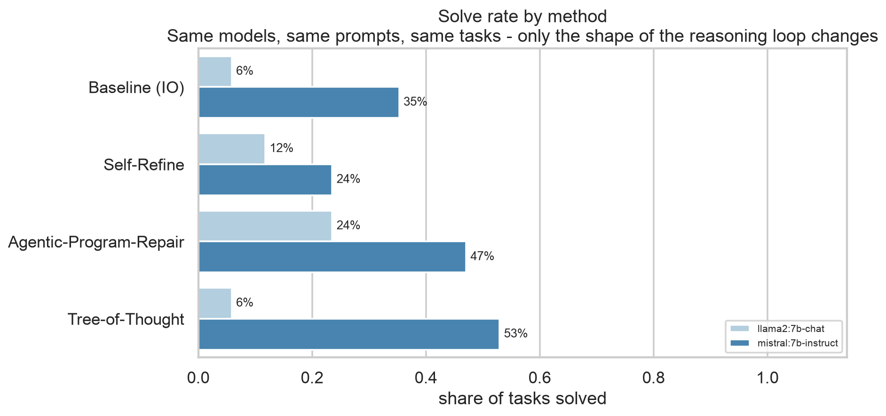
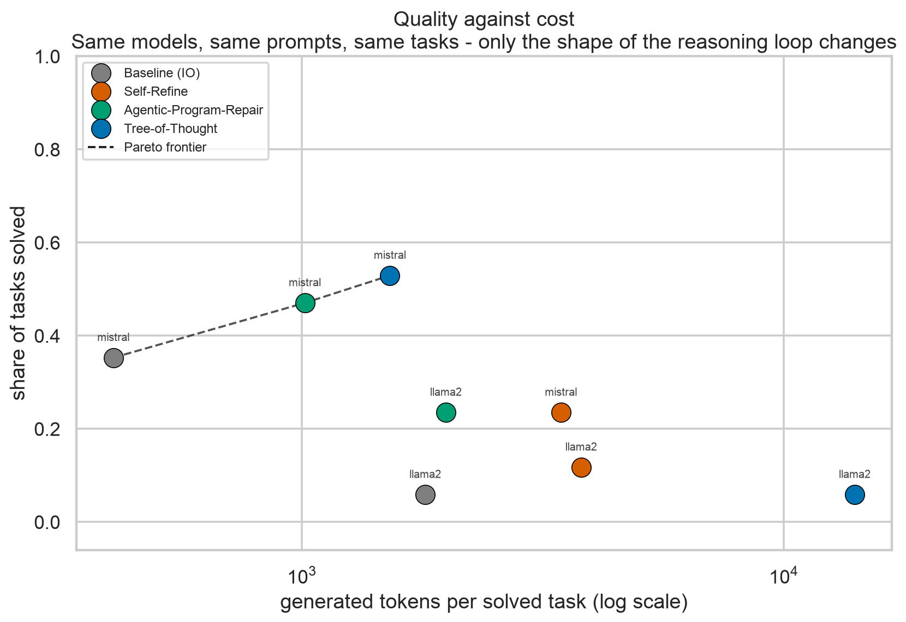
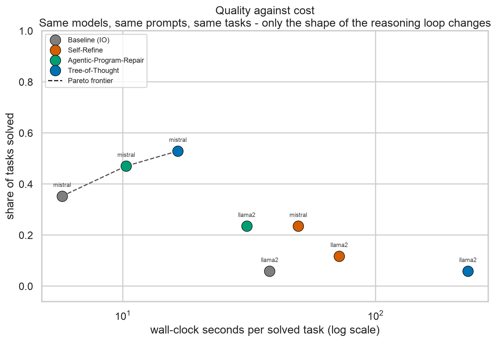
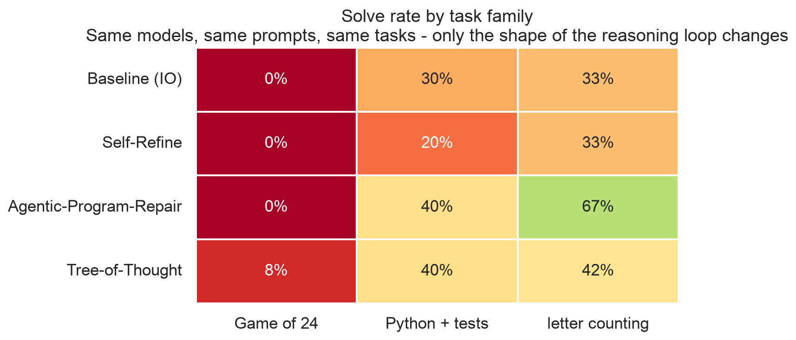
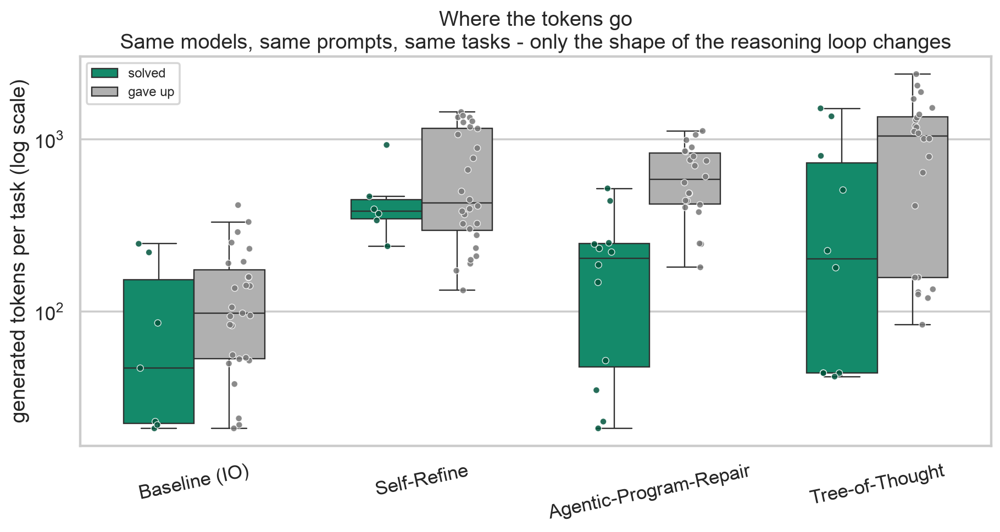

<!--
HOW TO PRESENT
  Renders as plain markdown on GitHub. For a real deck, either:
    marp slides/deck.md -o slides/deck.pdf        (npx @marp-team/marp-cli)
    or paste into any markdown slide tool (Slidev, Deckset, Marp for VS Code).
  Figure paths are relative to the repo root, so build/export from there:
    cd .. && marp slides/deck.md -o slides/deck.pdf
  Presenter notes are the "Notes:" bullets - they are for speaking, not for the screen.
-->

# Three ways to make a small model think longer

**Baseline (IO) vs. Self-Refine vs. Tree-of-Thought vs. Agentic-Program-Repair**

Same models. Same prompts. Same tasks. Only the shape of the reasoning loop changes.

*136 runs · 2 models · 17 verified tasks · 2 × RTX PRO 6000 Blackwell*

---

# First, the four methods in one line each

| Method | Paper | What it does |
|---|---|---|
| **Baseline (IO)** | — | Answers once. No feedback, no second chance. |
| **Self-Refine** | Madaan et al. 2023 | Critiques its own answer, then rewrites it. Repeats. |
| **Tree-of-Thought** | Yao et al. 2023 | Keeps several half-finished attempts alive, scores them, expands the best, prunes the rest. |
| **Agentic-Program-Repair** | Maddila et al. 2025 | Tries again from scratch, and lets **real tests** decide when to stop. |

**The one-sentence version:** two methods generate more text, one branches, one *checks*.

Notes:
- Set up the axis we are testing: is the win from more thinking, from branching, or from verification?
- Note that Self-Refine and APR are both linear loops. The difference is who decides you are done: the model itself, or a test.
- Keep this slide up while you explain; do not rush it.

---

# What "Agentic Program Repair" means here

**Automated Program Repair**: when a test breaks, automatically write the code change that makes it pass again.

Maddila et al. run this at Meta across a huge monorepo: an agent reads the failing test, edits code, runs the tests, and repeats. Their headline result is not a clever algorithm — it is **feedback plus retries**:

| Their system | Solve rate |
|---|---|
| Agent alone | 28.5% |
| \+ static analysis feedback | 34.1% |
| \+ **test execution feedback** | **43.9%** |
| Best single patch of many attempts | 46.3% |
| **5 repeated runs of the whole loop** | **61.0%** |

Notes:
- Plain language: "the tests are the teacher." The model does not have to *know* it is right; it has to make the tests pass.
- Key nuance for our experiment: the APR paper's gain comes from a verifier plus retries — NOT from tree search. That is exactly what we test.
- If asked "is this MCTS over patches?" — no. The paper does not do tree search. We implement what it actually does: independent attempts, verified.
- One more nuance: APR's agent can read files, run tests, and take 15 different actions. Our tasks are small and self-contained, so the agent-shaped part reduces to "write code, run tests, try again."

---

# The three task families

| Family | Task | The model must produce | How we grade it |
|---|---|---|---|
| **Game of 24** | Use four numbers and `+ - * /` to make exactly 24 | Equations, ending in an `Answer:` line | Exact arithmetic check: equals 24, uses each number once |
| **Python + tests** | Write a function from a docstring (merge intervals, rotate a matrix, parse a formula…) | A code block | **Real unit tests run in a subprocess** |
| **Letter counting** | Count one letter in a tricky word ("strawberry", "Mississippi", "refrigerator") | An inventory line, then a count | Exact count match |

**Nothing is graded by a model.** Every pass/fail comes from arithmetic, a test run, or a string compare.

Notes:
- Emphasise the grading: this is why the pass/fail column can be trusted. An LLM-as-judge could not tell you whether ToT actually works.
- Letter counting is a deliberate trap: these are exactly the questions where models confidently say "2 r's in strawberry".
- The tests are the same feedback the APR paper uses, in miniature.
- 17 tasks ran: 6 Game of 24, 5 programs, 6 letter-counting words — per model per method. (The suite defines 19; the run used 6 of 8 math puzzles.)

---

# Setup

| | |
|---|---|
| **Models** | `llama2:7b-chat` and `mistral:7b-instruct` — two 7B models from the same era as the papers |
| **Serving** | Ollama, on 2 GPUs, `NUM_PARALLEL=4`, 6 tasks in flight |
| **Scale** | 2 models × 4 methods × 17 tasks = **136 runs** |
| **Budget** | Same prompts and same task for all four methods; hard cap of 60 model calls per task |
| **Metrics** | Solve rate, generated tokens, model calls, wall-clock seconds |

**Cost is reported per *solved* task** — total tokens spent divided by tasks actually solved. A method that burns tokens without solving anything cannot hide behind an average.

Notes:
- Be upfront about the caveat: 136 runs across 4 methods is 34 runs per method. Directional, not a significance test.
- The 60-call cap never bound for Baseline or APR; ToT used ~7 calls on average, 10 max.
- The seconds column includes time waiting for a parallel slot, so it is an upper bound on latency, not clean per-call speed. Token counts are unaffected.

---

# Result 1 — Who solves the most, and who solves the most per token

| | Baseline (IO) | Self-Refine | Agentic-Program-Repair | Tree-of-Thought |
|---|---|---|---|---|
| **Overall** | 21% | 18% | **35%** | 29% |
| **tokens per solve** | **606** | 3,567 | 1,340 | 2,776 |

**Agentic-Program-Repair wins on both axes.** More solves than any other method, at less than half of Self-Refine's cost per solve.

Notes:
- Plain language: "the method that runs real tests and retries got the most right, and it did not need the most text to do it."
- The surprise is how badly Self-Refine does: 18% is *worse than answering once* (21%) — at 5.7× the model calls and 5.9× the tokens.
- Why: Self-Refine's only source of truth is the model's own critique, and a 7B model's critique is only as good as the model. It often "confirms" a wrong answer. We saw it approve a strawberry count of 2 seven times in a row.
- Baseline's 606 tokens per solve is a real number, not a trick: it solves the easy tasks in one shot, cheaply.
- Point at the table, not the chart, for the cost column — the chart shows rates only.

---

# Result 2 — The trade-off: quality bought with compute

Reading right to left on the frontier (Mistral): **406 tokens → 35%**, **1,015 → 47%**, **1,524 → 53%**.
Each step buys real accuracy. The steps get more expensive as you climb.

**Self-Refine sits below the frontier** — it is dominated: worse *and* more expensive than the alternatives.

Notes:
- This is the slide to linger on. Everything else is a table; this one shows the actual argument.
- "Pareto frontier" in plain terms: the dashed line is the set of methods where nothing else is both cheaper and better. Anything under the line is a bad deal.
- The three frontier points are all the *same model* (Mistral). On Llama-2 the whole frontier shifts down and out — the method cannot rescue a model that cannot generate good work.
- The key sentence: search buys accuracy, and it is worth paying for — up to a point, and only when the base model is competent.
- If someone asks why Baseline appears at 406 tokens/solve with 35%: it solves the easy majority of tasks on the first try, so its *average spend per win* is low.

---

# Result 3 — The same trade, measured in time

Seconds per solved task tell the same ordering as tokens: **Baseline (IO) 10.4s → APR 17.2s → ToT 38.1s → Self-Refine 56.9s**.

**Caveat:** these timers include waiting for a GPU slot (6 tasks in flight, 4 slots), so treat them as an upper bound, not clean model latency.

Notes:
- Show this only if time is short on tokens, or if someone in the room cares about serving cost rather than API cost.
- The honest framing: "the ordering is stable, the absolute numbers are not. If I wanted true latency I would rerun with one task at a time."
- Worth noting that Self-Refine is ~22× Baseline in time per solve while being *worse* at solving. Sequential critique is the worst of both worlds.
- Do not over-claim: at this scale the second axis mostly confirms the first rather than adding new information.

---

# Result 4 — Where each method earns its keep

| | Game of 24 | Python + tests | Letter counting |
|---|---|---|---|
| Baseline (IO) | 0% | 30% | 33% |
| Self-Refine | 0% | 20% | 33% |
| **Agentic-Program-Repair** | 0% | **40%** | **67%** |
| **Tree-of-Thought** | **8%** | **40%** | 42% |

**Game of 24 is a wall.** 47 of 48 attempts failed. GPT-4 with ToT solved 74% of these in the paper; a 7B model from 2023 simply cannot.

Notes:
- The paper's headline (74% vs 4% for chain-of-thought) is a GPT-4 result. Our 7B models cannot do the task at all, so ToT has nothing to search over. That is the single most important caveat in the deck — say it out loud.
- We verified this is not a grading bug: we scanned every failed math run for a correct answer that we had rejected for missing the `Answer:` format. Zero found.
- APR's 67% on letter counting is the clearest demonstration of the thesis: for a task with an exact, cheap check, retrying with that check is the strongest and cheapest strategy.
- ToT's one win is on the hardest family, which is at least consistent with its premise.

---

# Result 5 — Where the tokens actually go

The pattern to notice: **failed runs cost more than successful ones** for every method except Baseline.

| | solved | gave up |
|---|---|---|
| Baseline (IO) | 95 | 132 |
| Self-Refine | 457 | 666 |
| Agentic-Program-Repair | **198** | 623 |
| Tree-of-Thought | 477 | 958 |

Notes:
- Plain language: "APR is decisive. When it is right it stops early and cheaply; when it is wrong it pays for its three attempts and quits."
- ToT and Self-Refine grind: they keep generating long after it is clear they are wrong, because neither has a way to know it is finished.
- This is the hidden cost of "thinking more": without a stopping signal, extra deliberation is spent on failures.
- Tie back to APR's paper: their ablation shows test feedback is what converts attempts into solves, and their 61% figure requires running the whole loop five times. Verification plus retries, not deeper search.

---

# What I take away

1. **The verifier is the win, not the tree.** Real tests turned extra compute into accuracy; branching alone did not.
2. **Self-Refine is the worst value here.** It cost the most and beat one-shot on neither model. A model's critique of itself is bounded by the model.
3. **Search needs something to search with.** ToT went from 6% to 53% between the two models *with identical code and prompts* — it amplifies a capable model and wastes compute on a weak one.
4. **Cost per *solve*, not cost per *token*.** Every method here can be made to spend more; only some convert that into correct answers.

**Caveats:** 34 runs per method is directional, not statistical. Two 7B models from 2023. Game of 24 was out of reach, so the math family contributes almost nothing. Seconds are contaminated by parallel scheduling.

Notes:
- Close on point 1 — it is the same lesson as the APR paper's own ablation, reproduced at 1/50th the scale.
- If asked "so is Tree-of-Thought useless?" — no. It won on Mistral, the more capable model, and it won the math family. The finding is that its payoff depends on the base model being good enough to produce promising thoughts.
- If asked what you would run next: raise `--n`, add a fourth model, and measure a task where partial credit is cheap (like Game of 24) so ToT's scoring step has real signal.
