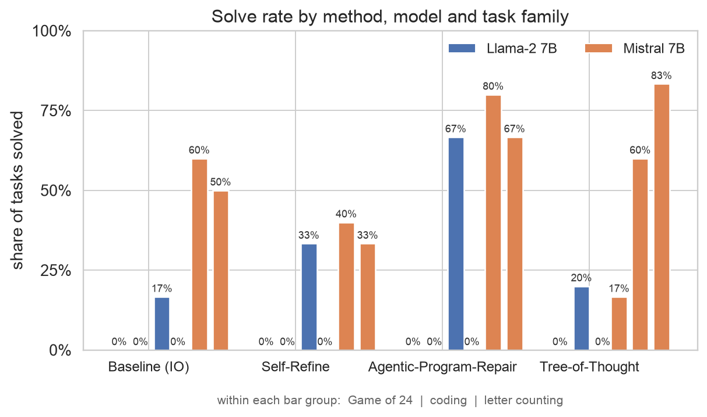
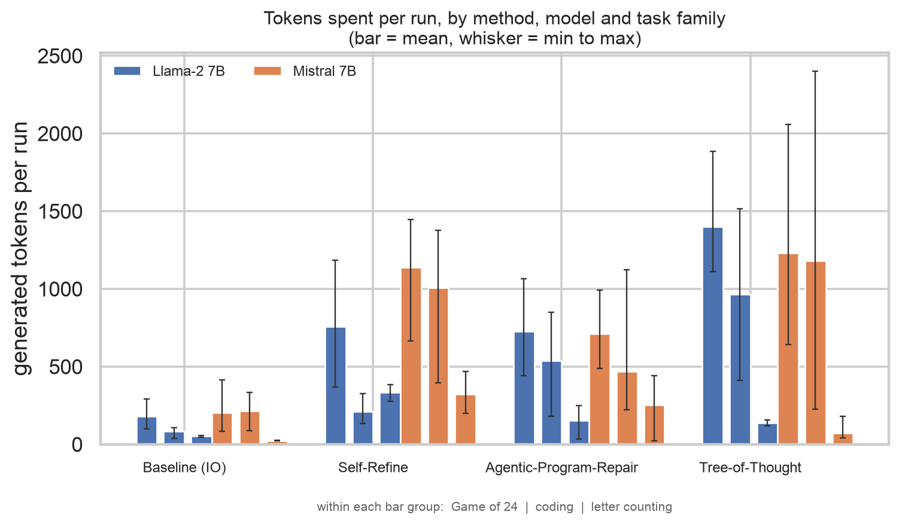
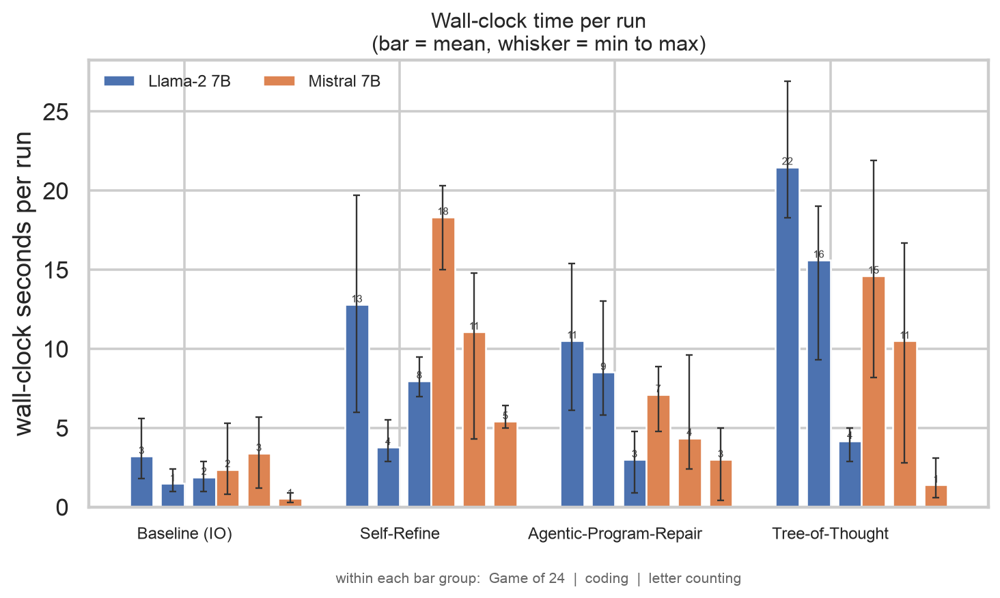

<!--
RENDER  (from the repo root - no theme file needed)
  marp slides/deck.md -o slides/deck.pdf --allow-local-files
Presenter notes live in HTML comments and never render into the PDF.
-->

# Should Agents Reason Linearly or as a Tree?

**Baseline (IO)** vs. **Self-Refine** vs. **Tree-of-Thought** vs. **Agentic-Program-Repair**

Same models, same prompts, same tasks. Different reasoning loop.

*136 runs · 2 models · 17 verified tasks · 2 × RTX PRO 6000 Blackwell*

---

## Methods

| Method | Paper | What it does |
|---|---|---|
| **Baseline (IO)** | — | One-shot autoregressive rollout |
| **Self-Refine** | Madaan et al. 2023 | LLM critiques its own answer at every round |
| **Tree-of-Thought** | Yao et al. 2023 | Keeps several half-finished attempts alive, scores them, expands the best, prunes the rest. |
| **Agentic-Program-Repair** | Maddila et al. 2025 | Make N independent attempts, keep those that pass tests. |

<!--
Notes:
- Two methods generate more text (Self-Refine, Tree-of-Thought). One branches. One checks.
- The axis we are testing: is the win from more thinking, from branching, or from verification?
- Self-Refine and APR are both linear loops. The difference is who decides you are done: the model itself, or a test.
-->

---

## Summary: Agentic Program Repair

Use deterministic, verifiable tests to determine correctness. Think: Test-Driven Development.

In the paper: an agent reads the failing tests, edits code, runs the tests, and repeats. Their headline result is not a clever algorithm — it is **feedback plus retries**:

| Their system | Solve rate |
|---|---|
| Agent alone | 28.5% |
| \+ static analysis feedback | 34.1% |
| \+ **test execution feedback** | **43.9%** |
| Best single patch of many attempts | 46.3% |
| **5 repeated runs of the whole loop** | **61.0%** |

The Engineering Agent is an internal Meta system and is **not open-source**, so our implementation is built from the paper alone — keeping the transferable part: fresh attempts, judged by tests.

<!--
Notes:
- Plain language: "the tests are the teacher." The model does not have to know it is right; it has to make the tests pass.
- Key nuance: the paper's gain comes from a verifier plus retries — NOT from tree search. That is what we test.
- If asked "is this MCTS over patches?": no. The paper does not do tree search.
-->

---

---

## Our Experiments and task distribution

| Family | Tasks | How we grade it |
|---|---|---|
| **Game of 24** | 6 | Exact arithmetic check |
| **Coding** | 5 | **Real unit tests in a subprocess** |
| **Letter counting** | 6 | Exact count |
| **Total** | **17** | |

**Nothing is graded by a model.**

| Family | Task IDs |
|---|---|
| Game of 24 | `g24-0` … `g24-5` |
| Coding | `prog-merge_intervals`, `prog-rotate`, `prog-kth_largest`, `prog-parse_formula`, `prog-merge_sorted_arrays` |
| Counting | `count-strawberry`, `count-raspberry`, `count-Mississippi`, `count-bookkeeper`, `count-dreadnought`, `count-refrigerator` |

Each task gets 8 runs (2 models × 4 methods) → **136 runs**. Six were solved by nobody: `g24-1` … `g24-5` and `prog-parse_formula`.

<!--
Notes:
- Left: what each family asks for and how it is graded. The grading is entirely symbolic - arithmetic, real unit tests, exact counts - which is why the pass/fail numbers can be trusted.
- Right: the 17 task IDs, so any number in this deck traces to a specific task.
- Letter counting is a deliberate trap: these are questions where models confidently say "2 r's in strawberry".
- The unit tests are the same feedback signal the APR paper uses, in miniature.
- The suite defines 19 tasks; this run used 6 of the 8 Game of 24 puzzles, so 17 ran. Each family is small, so one solve moves a bar by ~8%.
- Full per-task detail is in visuals/TABLES.md.
-->

---

## Experiment Setup

| | |
|---|---|
| **Models** | `llama2:7b-chat` and `mistral:7b-instruct` — two 7B models from the same era as the papers |
| **Serving** | Ollama, 2 GPUs, `NUM_PARALLEL=4`, 6 tasks in flight |
| **Scale** | 2 models × 4 methods × 17 tasks = **136 runs** |
| **Budget** | Same prompts for all four methods; 60 model calls per task maximum |
| **Metrics** | Solve rate · generated tokens · model calls · wall-clock time |

**Cost is reported per *solved* task** — total tokens spent divided by tasks actually solved.

<!--
Notes:
- Be upfront: 136 runs is 34 runs per method. Directional, not a significance test.
- The 60-call cap never bound: ToT averaged 6.9 calls, 10 max.
- Timings include waiting for a parallel slot, so they are an upper bound on latency.
- Full hyperparameters are in the appendix.
-->

---

## Success rate

**Findings:** Agentic-PR leads overall (35%) and on both coding and counting. Tree-of-Thought only works on the stronger model (53% Mistral vs 6% Llama-2). Game of 24 is a wall: 1 solve in 48.

<!--
Notes:
- Each method shows two model bars; each splits into three skinny bars for {24, code, count}, in that order.
- The tall bars on the right are Agentic-PR on counting. ToT's only Game of 24 solve is the lone blue sliver.
- The key takeaway: no method dominates. Each family favours a different strategy.
- Not a grading bug: we scanned every failed math run for a correct answer rejected for a missing `Answer:` line. Zero found.
-->

---

## Tokens spent

**Findings:** Tree-of-Thought costs 9× more per solve on Llama-2 than on Mistral (14,045 vs 1,524), same code. Agentic-PR is the cheapest route to accuracy.

<!--
Notes:
- Bar height is the mean over every run, whisker spans min to max, so level and spread are both visible.
- Short Baseline bars are the signature of a method that cannot spend more: it never gets a second attempt.
- The headline of the deck: cost is a property of model-plus-method, not of the method alone.
- Agentic-PR: 1,340 tokens per solve against Baseline's 606, while solving nearly twice as many tasks.
-->

---

## Wall-clock time

**Findings:** Baseline 2.1s per run, Agentic-PR 6.1s, Self-Refine 10.0s, Tree-of-Thought 11.2s. Time tracks how many calls a method makes — not how good it is.

<!--
Notes:
- Same grouping as the other two figures: method, then model, then the three families.
- Caveat to state out loud: runs were 6-at-a-time against 4 serving slots, so absolute numbers include queueing. The ordering is the honest part.
- Agentic-PR beats Self-Refine on time despite making attempts, because it stops as soon as tests pass (mean 2.5 calls).
-->

---

## What I take away

1. **Verification is the win, not the tree.** Tests turn extra compute into correct answers. More thinking without a check mostly buys longer wrong answers.
2. **The methods are not interchangeable.** Agentic-PR owns counting and coding; Tree-of-Thought's best case is a harder task on a stronger model.
3. **Self-Refine is the weakest link here.** Most expensive, least accurate — worse than one-shot on every family.
4. **Time tracks the loop, not the result.** Baseline 2.1s per run, Agentic-PR 6.1s, Self-Refine 10.0s, Tree-of-Thought 11.2s.
5. **Cost depends on the model as much as the method.** Tree-of-Thought cost 9× more per solve on Llama-2 than on Mistral, with identical code.

*Caveats: 34 runs per method is directional, not statistical. Two 7B models from 2023. Game of 24 was out of reach, so the math family contributes almost nothing. Timings include GPU queue time.*

<!--
Notes:
- Point 1 is the APR paper's own ablation, reproduced at 1/50th the scale.
- If asked "so is Tree-of-Thought useless?": no. It won the hardest single task and came second overall, but only on the stronger model.
- If asked what is next: more runs per task, a stronger base model, and a task set where partial credit is meaningful so pruning has real signal.
-->

---

## Appendix A — What APR is in our implementation

**Independent fresh attempts, verified by tests. Not self-refine, and not a combination.**

| Attempt | What the model sees |
|---|---|
| 1 | the problem prompt, alone |
| 2 | the problem prompt + the rejected answer + *"start again with a DIFFERENT approach"* |
| 3 | the same, with attempt 2 as the rejected answer |

Each attempt is a complete, independent answer. Test results decide **whether to retry** — nothing is carried forward as a partial solution.

**Honest gap vs. the paper:** we tell the model *"the verifier rejected it"*, not *which test failed*. APR feeds the real test output back into the loop, so our signal is weaker than theirs.

<!--
Notes:
- Keep this slide for a technical audience, since the paper's system is closed-source.
- What we kept: N independent attempts, each judged by real tests. What we dropped: file reading, stack traces, the 15-action harness.
- If asked "why not feed the traceback back?" — our tasks are single-function problems with one-line assertions, so it adds little; but it is a fair criticism and cheap to add.
-->

---

## Appendix B — Key parameters (1 of 2)

| Parameter | Value |
|---|---|
| Models | `llama2:7b-chat`, `mistral:7b-instruct` (7B, 2023-era) |
| Serving | Ollama 0.40.0, CUDA, 2 × RTX PRO 6000 (95 GB each) |
| Concurrency | `NUM_PARALLEL=4`, 6 runs in flight (`--jobs 6`) |
| Tasks | 17 per model per method (6 math / 5 coding / 6 counting) |
| Runs | 2 models × 4 methods × 17 tasks = **136** |
| Call cap | 60 model calls per task (max observed: 10) |
| Output cap | 450 tokens per generation |

<!--
Notes:
- The 450-token cap is why some answers look truncated; it never bound on the short counting tasks.
- The call cap never bound for any method, so it is not what limited ToT.
-->

---

## Appendix B — Key parameters (2 of 2)

| Method | Setting |
|---|---|
| Baseline (IO) | temperature 0.0, 1 call |
| Self-Refine | temperature 0.7, max 4 rounds; critique at temperature 0.0, 120 tokens |
| Agentic-Program-Repair | temperature 0.9, 3 independent attempts |
| Tree-of-Thought | temperature 0.8; depth 3 (math) / 2 (others); expand 2; beam 2; scoring at temperature 0.0 |

**Verifiers** (`tasks.py`): unit tests in a subprocess with a 10 s timeout; an exhaustive solver for Game of 24; exact matching for counts.

**Deliberate fairness choice:** `--iters 4` (Self-Refine's paper default) and `--candidates 3` give all methods comparable numbers of attempts.

<!--
Notes:
- Temperature differences are intentional: the branching methods need diversity to search over, the one-shot baseline does not.
- The verifiers are the part I would defend hardest — grading never involves a model.
- If asked about tuning: these are paper defaults or round numbers, not swept. The sweep is the obvious next experiment.
-->
