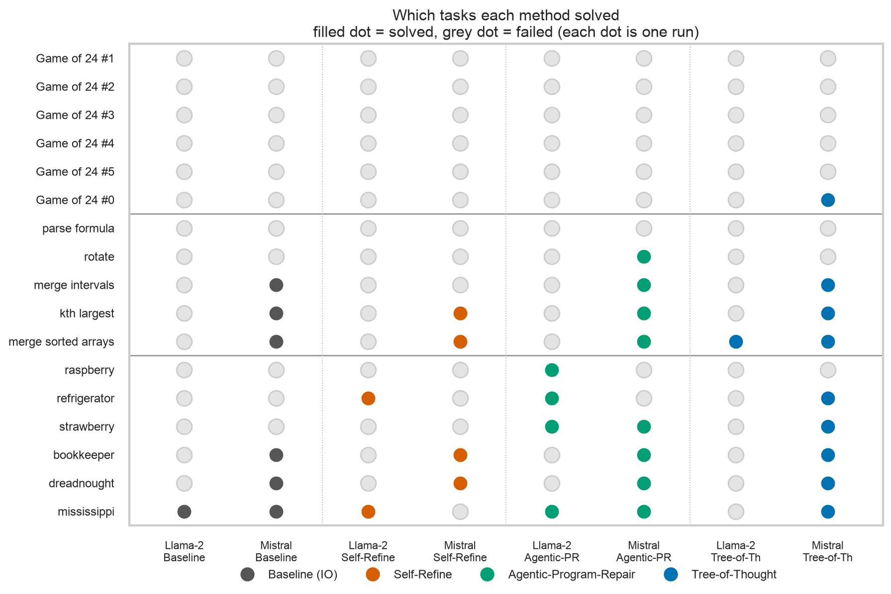
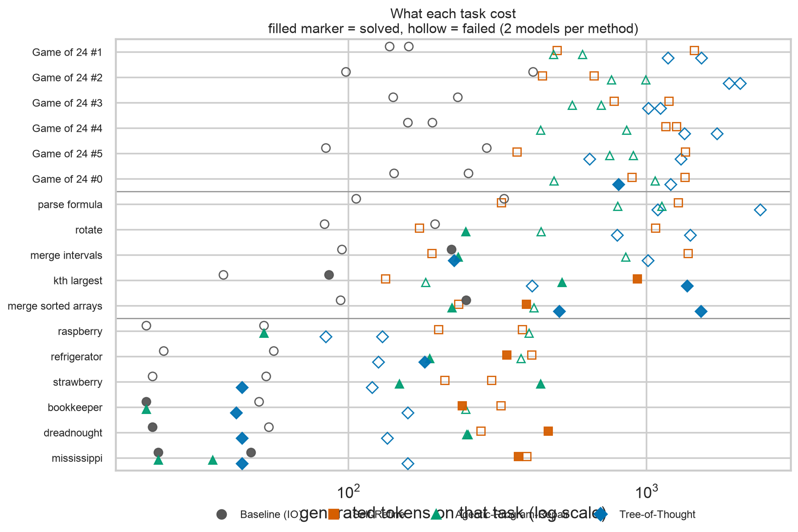

<!--
RENDER
  cd .. && marp slides/deck.md -o slides/deck.pdf
Figures are sized per slide to fit 16:9 (max height ~430px). Presenter notes are in
HTML comments so they never render into the PDF.
-->

# Should Agents Reason Linearly or as a Tree?

**Baseline (IO)** vs. **Self-Refine** vs. **Tree-of-Thought** vs. **Agentic-Program-Repair**

Same models, same prompts, same tasks. Different reasoning loop.

*136 runs · 2 models · 17 verified tasks · 2 × RTX PRO 6000 Blackwell*

Presenters: Andy Wang, Cecilia Xu, Bruce Li

---

# Methods

| Method | Paper | What it does |
|---|---|---|
| **Baseline (IO)** | — | One-shot autoregressive rollout |
| **Self-Refine** | Madaan et al. 2023 | LLM critiques its own answer at every round |
| **Tree-of-Thought** | Yao et al. 2023 | Keeps several half-finished attempts alive, scores them, expands the best, prunes the rest. |
| **Agentic-Program-Repair** | Maddila et al. 2025 | Make N independent attempts, keep those that pass tests. |

<!--
Notes:
- Two methods generate more text (Self-Refine, Tree-of-Thought). One branches. One checks.
- The axis we are testing: is the win from more thinking, from branching, or from verification?
- Note Self-Refine and APR are both linear loops. The difference is who decides you are done: the model itself, or a test.
-->

---

# Summary: Agentic Program Repair

Use deterministic, verifiable tests to determine correctness. Think: Test-Driven Development.

In the paper: an agent reads the failing tests, edits code, runs the tests, and repeats. Their headline result is not a clever algorithm — it is **feedback plus retries**:

| Their system | Solve rate |
|---|---|
| Agent alone | 28.5% |
| \+ static analysis feedback | 34.1% |
| \+ **test execution feedback** | **43.9%** |
| Best single patch of many attempts | 46.3% |
| **5 repeated runs of the whole loop** | **61.0%** |

The Engineering Agent is an internal Meta system and is **not open-source**, so our implementation is built from the paper alone — keeping the transferable part: fresh attempts, judged by tests.

<!--
Notes:
- Plain language: "the tests are the teacher." The model does not have to know it is right; it has to make the tests pass.
- Key nuance for our experiment: the paper's gain comes from a verifier plus retries — NOT from tree search. That is what we test.
- If asked "is this MCTS over patches?": no. The paper does not do tree search.
- Since the system is closed, we could not copy it. We reimplemented the described loop: independent attempts, verified by tests.
- One honest gap: we tell the model "the verifier rejected it", not which assertion failed. APR feeds the real test output back, so our version has a weaker signal than the paper's.
-->

---

# Our Experiments

| Family | Task | The model must produce | How we grade it |
|---|---|---|---|
| **Game of 24** | Use four numbers and `+ - * /` to reach 24 | Equations + an `Answer:` line | Exact arithmetic check |
| **Python + tests** | Write a function from a docstring | A code block | **Real unit tests in a subprocess** |
| **Letter counting** | Count one letter in a tricky word | Inventory line + count | Exact count |

**Nothing is graded by a model.** Every pass/fail comes from arithmetic, a test run, or a string compare.

17 tasks ran: 6 × Game of 24, 5 × Python, 6 × letter counting — per model, per method.

<!--
Notes:
- Emphasise the grading: this is why the pass/fail column can be trusted. An LLM-as-judge could not tell us whether search works.
- Letter counting is a deliberate trap: these are questions where models confidently say "2 r's in strawberry".
- The unit tests are the same feedback signal the APR paper uses, in miniature.
-->

---

# Experiment Setup

| | |
|---|---|
| **Models** | `llama2:7b-chat` and `mistral:7b-instruct` — two 7B models from the same era as the papers |
| **Serving** | Ollama, 2 GPUs, `NUM_PARALLEL=4`, 6 tasks in flight |
| **Scale** | 2 models × 4 methods × 17 tasks = **136 runs** |
| **Budget** | Same prompts for all four methods; 60 model calls per task maximum |
| **Metrics** | Solve rate · generated tokens · model calls · wall-clock time |

**Cost is reported per *solved* task** — total tokens spent divided by tasks actually solved.

<!--
Notes:
- Be upfront: 136 runs is 34 runs per method. Directional, not a significance test.
- The 60-call cap never bound: ToT averaged 6.9 calls, 10 max.
- Timings include waiting for a parallel slot, so they are an upper bound on latency, not clean per-call speed. Token counts are unaffected.
-->

---

# Why the pooled average misleads

| Method | Solved | Tokens per solve |
|---|---|---|
| Baseline (IO) | 21% | 606 |
| Self-Refine | 18% | 3,567 |
| Agentic-PR | **35%** | 1,340 |
| Tree-of-Thought | 29% | 2,776 |

**6 of 17 tasks were solved by nobody.** They sit in every method's denominator equally, so they drag all four numbers down.

Every claim from here on is made one task at a time.

<!--
Notes:
- This slide is the honest version of the headline number, and it is what people will ask for.
- The trap: task mix drives the whole table. Six tasks contaminate the comparison in the same way for everyone.
- Keep this up briefly, then move to the per-task picture.
-->

---

# Finding 1 — No method wins. Each method owns different tasks.

| | Task | Solved by |
|---|---|---|
| Only Tree-of-Thought | Game of 24 #0 | 1 of 8 runs |
| Only Agentic-PR | rotate · raspberry | 1 of 8 each |
| Nobody | 5 × Game of 24 · parse formula | **0 of 8** |

<!--
Notes:
- Read the dots, not the averages. Filled = solved; grey = failed. Each dot is one run.
- The real headline is not "APR wins". It is "these methods are not interchangeable" — each has a niche.
- Tree-of-Thought's only unique win is the hardest single task in the suite. Agentic-PR owns the two tasks where one retry fixes a near-miss.
- The paper's famous 74% on Game of 24 is a GPT-4 result. These 7B models cannot do the task at all, so search has nothing to search over.
- This is not a grading bug: we scanned every failed math run for a correct answer rejected for a missing `Answer:` line. Zero found.
-->

---

# Finding 2 — Hard tasks cost more, and failing costs more than succeeding

<!--
Notes:
- Every row is one task; every marker is one run. Filled = solved, hollow = failed.
- Two patterns: hollow markers sit further right than filled ones (failure burns tokens), and the Game of 24 rows are furthest right of all.
- So a token bill is not a measure of effort — it measures not knowing when to stop.
- Baseline is the exception: it cannot spend more, so its failures are cheap. It also never gets a second chance.
-->

---

# Finding 3 — Agentic-PR's wins concentrate where checking is cheap

| Task | Baseline (IO) | Self-Refine | Agentic-PR | Tree-of-Thought |
|---|---|---|---|---|
| count Mississippi | 2/2 | 1/2 | **2/2** | 1/2 |
| count bookkeeper | 0/2 | 1/2 | **2/2** | 1/2 |
| count dreadnought | 0/2 | 1/2 | **2/2** | 1/2 |
| count strawberry | 0/2 | 0/2 | **2/2** | 1/2 |
| count raspberry | 0/2 | 0/2 | **1/2** | 0/2 |
| count refrigerator | 0/2 | **1/2** | **1/2** | 0/2 |

*(each cell: of 2 runs — one per model)*

**Two thirds of Agentic-PR's 12 solves come from this one family** — 8 of 12 runs, and 8 counting solves out of 12 total.

It spends about twice what Tree-of-Thought does on these tasks (203 vs 105 tokens per run), and solves nearly twice as many.

<!--
Notes:
- Counting is a perfect fit: the answer is exactly checkable, so "try again" is a real strategy rather than a hope.
- This is the paper's thesis in miniature. When a cheap, exact check exists, retries with that check beat clever search.
- The table is per task, so one lucky task cannot carry the column.
- The one counter-example — refrigerator — is the next slide.
-->

---

# Finding 4 — One task rewards keeping your place

`count-refrigerator` → the answer is **4**

| Method | Llama-2 7B | Tokens | Rounds |
|---|---|---|---|
| Baseline (IO) | wrong | 56 | 1 |
| Self-Refine | **correct** | 339 | 7 |
| Agentic-PR | **correct** | 187 | 3 |
| Tree-of-Thought | wrong — answered **6** | 126 | 5 |

Tree-of-Thought spent more than the two methods that got it right, and got it wrong.

<!--
Notes:
- The mechanism: the tree stores only each node's checkable fragment. For counting, that is the letter list — not the running count. So the tree re-derives the count from scratch each round and re-derives it wrongly.
- Self-Refine keeps the whole previous answer in context, so it can correct its own count.
- The lesson is not "trees are bad". It is that the state you keep decides what the method can fix. Small checkable state is what makes pruning possible — and it is also what gets lost.
- Own this as an implementation choice: the node format was designed for search efficiency.
-->

---

# Finding 5 — Self-Refine costs the most and gains the least

| Method | Solved (of 34 runs) | Tokens per solve | Model calls per run |
|---|---|---|---|
| Baseline (IO) | 7 | **606** | 1.0 |
| Self-Refine | 6 | 3,567 | 5.7 |
| Agentic-PR | **12** | 1,340 | 2.5 |
| Tree-of-Thought | 10 | 2,776 | 6.9 |

**Self-Refine was worse than answering once** — at 5.9× the tokens and 5.7× the calls.

Its stop condition almost never fired: 5 of its 6 successful runs hit the round limit instead of the model deciding it was done.

<!--
Notes:
- Mechanism: Self-Refine's only source of truth is the model's own critique, and a 7B model's critique is only as good as the model. It repeatedly confirmed wrong answers.
- We watched it approve a strawberry count of 2 through seven consecutive rounds.
- If asked what would fix it: an external check. Which is exactly what APR adds.
-->

---

# What I take away

**1. Verification is the win, not the tree.** Tests turn extra compute into correct answers. More thinking without a check mostly buys longer wrong answers.

**2. The methods are not interchangeable.** Tree-of-Thought's only unique win was the hardest task; Agentic-PR owned the retry-friendly ones.

**3. Self-Refine is the weakest link.** Most expensive, least accurate — worse than one-shot.

**4. What you keep in the state decides what you can fix.** Tree-of-Thought lost a task Self-Refine won, because its compact state discarded the running count.

*Caveats: 34 runs per method is directional, not statistical. Two 7B models from 2023. Game of 24 was out of reach, so the math family contributes almost nothing. Timings include GPU queue time.*

<!--
Notes:
- Point 1 is the APR paper's own ablation, reproduced at 1/50th the scale.
- If asked "so is Tree-of-Thought useless?": no. It won the single hardest task, came second overall, and went from 6% on Llama-2 to 53% on Mistral with identical code. Its payoff depends on the base model.
- If asked what is next: more runs per task, a stronger base model, and a task set where partial credit is meaningful so pruning has real signal.
-->
