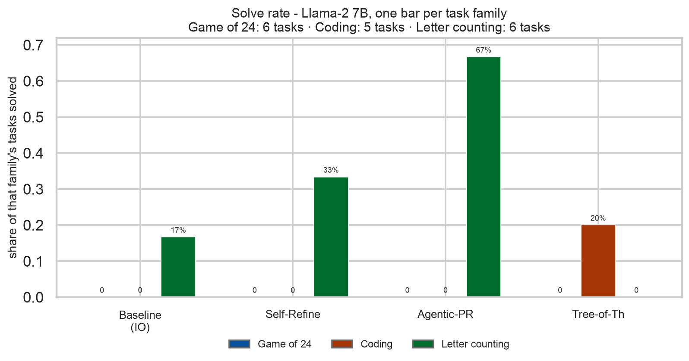
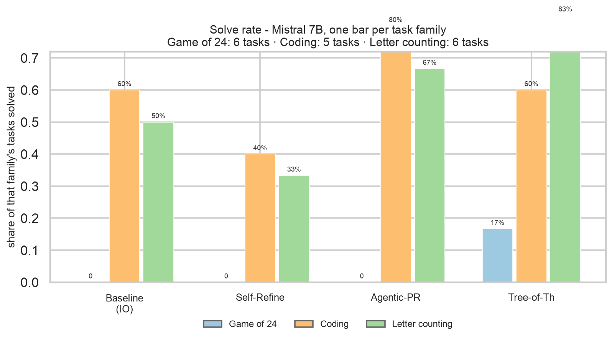
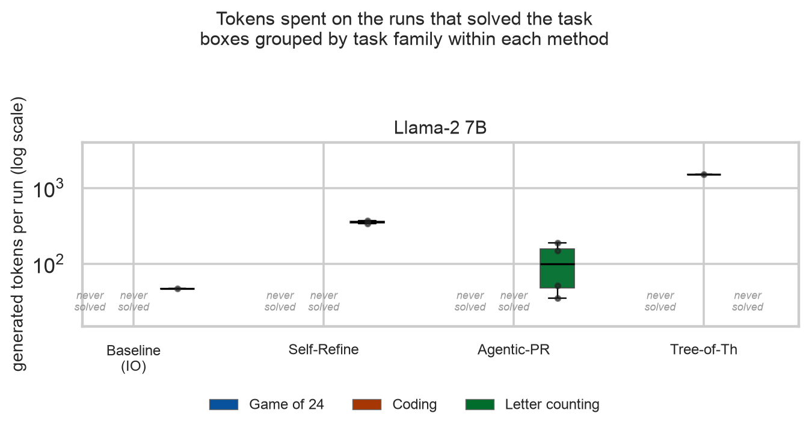
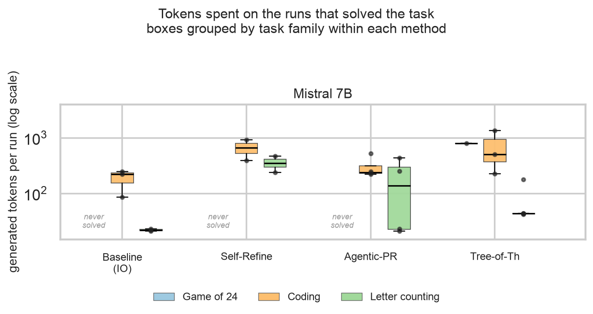
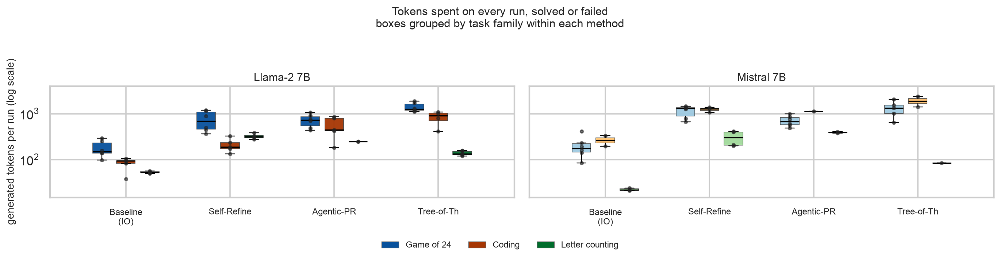

<!--
RENDER
  cd .. && marp slides/deck.md -o slides/deck.pdf --allow-local-files
Image paths are relative to the repo root, so render from the project root.
Presenter notes are in HTML comments and never appear in the PDF.
Figures are sized to stay under ~430px tall so nothing runs off a 16:9 slide.
-->

# Should Agents Reason Linearly or as a Tree?

**Baseline (IO)** vs. **Self-Refine** vs. **Tree-of-Thought** vs. **Agentic-Program-Repair**

Same models, same prompts, same tasks. Different reasoning loop.

*136 runs · 2 models · 17 verified tasks · 2 × RTX PRO 6000 Blackwell*

Presenters: Andy Wang, Cecilia Xu, Bruce Li

---

# Methods

| Method | Paper | What it does |
|---|---|---|
| **Baseline (IO)** | — | One-shot autoregressive rollout |
| **Self-Refine** | Madaan et al. 2023 | LLM critiques its own answer at every round |
| **Tree-of-Thought** | Yao et al. 2023 | Keeps several half-finished attempts alive, scores them, expands the best, prunes the rest. |
| **Agentic-Program-Repair** | Maddila et al. 2025 | Make N independent attempts, keep those that pass tests. |

<!--
Notes:
- Two methods generate more text (Self-Refine, Tree-of-Thought). One branches. One checks.
- The axis we are testing: is the win from more thinking, from branching, or from verification?
- Self-Refine and APR are both linear loops. The difference is who decides you are done: the model itself, or a test.
-->

---

# Summary: Agentic Program Repair

Use deterministic, verifiable tests to determine correctness. Think: Test-Driven Development.

In the paper: an agent reads the failing tests, edits code, runs the tests, and repeats. Their headline result is not a clever algorithm — it is **feedback plus retries**:

| Their system | Solve rate |
|---|---|
| Agent alone | 28.5% |
| \+ static analysis feedback | 34.1% |
| \+ **test execution feedback** | **43.9%** |
| Best single patch of many attempts | 46.3% |
| **5 repeated runs of the whole loop** | **61.0%** |

The Engineering Agent is an internal Meta system and is **not open-source**, so our implementation is built from the paper alone — keeping the transferable part: fresh attempts, judged by tests.

<!--
Notes:
- Plain language: "the tests are the teacher." The model does not have to know it is right; it has to make the tests pass.
- Key nuance for our experiment: the paper's gain comes from a verifier plus retries — NOT from tree search. That is what we test.
- If asked "is this MCTS over patches?": no. The paper does not do tree search.
- Since the system is closed we could not copy it; see Appendix B for exactly what we implemented.
-->

---

# Our Experiments

| Family | Task | The model must produce | How we grade it |
|---|---|---|---|
| **Game of 24** | Use four numbers and `+ - * /` to reach 24 | Equations + an `Answer:` line | Exact arithmetic check |
| **Coding** | Write a function from a docstring | A code block | **Real unit tests in a subprocess** |
| **Letter counting** | Count one letter in a tricky word | Inventory line + count | Exact count |

**Nothing is graded by a model.** Every pass/fail comes from arithmetic, a test run, or a string compare.

<!--
Notes:
- Emphasise the grading: this is why the pass/fail column can be trusted. An LLM-as-judge could not tell us whether search works.
- Letter counting is a deliberate trap: these are questions where models confidently say "2 r's in strawberry".
- The unit tests are the same feedback signal the APR paper uses, in miniature.
- Task counts are in Appendix A.
-->

---

# Experiment Setup

| | |
|---|---|
| **Models** | `llama2:7b-chat` and `mistral:7b-instruct` — two 7B models from the same era as the papers |
| **Serving** | Ollama, 2 GPUs, `NUM_PARALLEL=4`, 6 tasks in flight |
| **Scale** | 2 models × 4 methods × 17 tasks = **136 runs** |
| **Budget** | Same prompts for all four methods; 60 model calls per task maximum |
| **Metrics** | Solve rate · generated tokens · model calls · wall-clock time |

**Cost is reported per *solved* task** — total tokens spent divided by tasks actually solved.

<!--
Notes:
- Be upfront: 136 runs is 34 runs per method. Directional, not a significance test.
- The 60-call cap never bound: ToT averaged 6.9 calls, 10 max.
- Timings include waiting for a parallel slot, so they are an upper bound on latency. Token counts are unaffected.
- Full hyperparameters are in Appendix C.
-->

---

# Success rate — Llama-2 7B

**Findings (left):** no method solves a single Game of 24 puzzle. **Self-Refine and Tree-of-Thought gain nothing on coding** (0/5 each). Agentic-PR's only wins are counting (4/6).

<!--
Notes:
- The story on Llama-2 is blunt: this model is too weak for search to help. Three of four methods solve 0 coding tasks.
- Agentic-PR's 4/6 on counting is the one place extra attempts convert into correct answers.
- ToT is the only method that never solves a counting task on this model, despite spending the most tokens of any method here (14,045 per solve).
-->

---

# Success rate — Mistral 7B

**Findings (right):** with a stronger model every method improves. **Tree-of-Thought is co-best on coding (3/5)** and the *only* method to solve any Game of 24 puzzle. Agentic-PR still leads counting (4/6).

<!--
Notes:
- Same code, same prompts as the previous slide - only the model changed. That is the cleanest evidence that these methods amplify a capable model rather than rescuing a weak one.
- ToT goes from 6% overall on Llama-2 to 53% on Mistral.
- Even here, nobody solves Game of 24 reliably: 1 solve out of 24 Mistral attempts across all four methods.
-->

---

# Success rate — both models, all six bars

Overall: **Agentic-PR 35%**, Tree-of-Thought 29%, Baseline (IO) 21%, Self-Refine 18%.

Counting separates the methods most: Agentic-PR 8/12 runs vs Baseline 4/12.

<!--
Notes:
- This is the combined view; keep it for audience questions rather than presenting it as the headline.
- Colour + position identify each bar: dark = Llama-2, light = Mistral; blue = Game of 24, orange = coding, green = counting.
- Self-Refine never beats Baseline on any family.
-->

<!--
Notes:
- Each bar is one method on one family on one model: 6 bars per method. Read colour + position together.
- The tall green bars are Agentic-PR on counting. The one tall blue bar is ToT on Mistral.
- Point out the dark-blue bars at zero: ToT on Llama-2 solved nothing on counting, and only 1/5 on coding. Baseline and APR also score 0 on coding with Llama-2, so Llama-2 is simply weak at code.
- The key takeaway: no method dominates. Each family favours a different strategy.
- This is not a grading bug: we scanned every failed math run for a correct answer rejected for a missing `Answer:` line. Zero found.
-->

---

# Tokens spent — Llama-2 7B

**Findings (left):** Tree-of-Thought **never solves a counting task** here, and costs the most per solve of any method (**14,045 tokens**). Self-Refine is the second most expensive at **3,800** and still loses to one-shot.

<!--
Notes:
- Boxes show only runs that solved the task; "never solved" labels are findings in their own right.
- This is the cost of search without a competent generator: ToT expands branches that never become good answers.
- Compare with the next slide: identical code, same prompts, 9x cheaper per solve on Mistral.
-->

---

# Tokens spent — Mistral 7B

**Findings (right):** the same method costs **1,524 tokens per solve** on Mistral instead of 14,045. Tree-of-Thought becomes the cheapest of the three deliberate methods, because it stops early when a branch validates.

<!--
Notes:
- The headline of the whole deck is on this pair of slides: cost is a property of model-plus-method, not of the method alone.
- Agentic-PR remains the best value overall: 1,340 tokens per solve against Baseline's 606 while solving nearly twice as many tasks.
- Self-Refine is expensive on both models (~3,500 overall) and never beats Baseline.
-->

---

# Tokens, both models side by side (reference)

Every run, solved or failed. Failures cost more than successes for every method except Baseline.

<!--
Notes:
- Keep for appendix duty or audience questions; the per-model slides carry the argument.
- The pattern: without a stopping signal, extra deliberation is spent on failures.
-->

<!--
Notes:
- Boxes show only the runs that solved the task, so the "never solved" labels are themselves a finding: ToT on Llama-2 never produced a single correct counting answer, though it did manage 1 of 5 coding tasks.
- The second figure (visuals/tokens-all.png) shows every run including failures if someone wants the full picture.
- The ToT Llama-2 number is the headline caveat: search amplifies a capable model and wastes compute on a weak one.
- If asked about time instead of tokens: same ordering, roughly 2s/10s/6s/11s per run for Baseline/Self-Refine/APR/ToT, inflated by GPU queueing.
-->

---

# What I take away

**1. Verification is the win, not the tree.** Tests turn extra compute into correct answers. More thinking without a check mostly buys longer wrong answers.

**2. The methods are not interchangeable.** Agentic-PR owns counting and coding; Tree-of-Thought's best case is a harder task on a stronger model.

**3. Self-Refine is the weakest link here.** Most expensive, least accurate — worse than one-shot on every family.

**4. Cost depends on the model as much as the method.** Tree-of-Thought cost 9× more per solve on Llama-2 than on Mistral with identical code.

*Caveats: 34 runs per method is directional, not statistical. Two 7B models from 2023. Game of 24 was out of reach, so the math family contributes almost nothing. Timings include GPU queue time.*

<!--
Notes:
- Point 1 is the APR paper's own ablation, reproduced at 1/50th the scale.
- If asked "so is Tree-of-Thought useless?": no. It won the hardest single task and came second overall, but only on the stronger model.
- If asked what is next: more runs per task, a stronger base model, and a task set where partial credit is meaningful so pruning has real signal.
-->

---

# Appendix A — Task distribution

| Family | Tasks | Runs per model, per method |
|---|---|---|
| Game of 24 | 6 | 6 |
| Coding | 5 | 5 |
| Letter counting | 6 | 6 |
| **Total** | **17** | **17** |

Total runs: 2 models × 4 methods × 17 tasks = **136**

Per task, 8 runs (2 models × 4 methods). Six tasks were solved by nobody: five Game of 24 puzzles and `parse_formula`.

<!--
Notes:
- The suite defines 19 tasks; this run used 6 of the 8 available Game of 24 puzzles, so 17 ran.
- Each family is small (5-6 tasks), which is why every single solve moves a bar by ~8%.
- Full per-task detail is in visuals/TABLES.md.
-->

---

# Appendix B — What APR is in our implementation

**Independent fresh attempts, verified by tests. Not self-refine, and not a combination.**

| Attempt | What the model sees |
|---|---|
| 1 | the problem prompt, alone |
| 2 | the problem prompt + the rejected answer + *"start again with a DIFFERENT approach"* |
| 3 | the same, with attempt 2 as the rejected answer |

Each attempt is a complete, independent answer. Test results decide **whether to retry** — nothing is carried forward as a partial solution.

**Honest gap vs. the paper:** we tell the model *"the verifier rejected it"*, not *which test failed*. APR feeds the real test output back into the loop, so our signal is weaker than theirs.

<!--
Notes:
- This is the slide to keep for a technical audience, since the paper's system is closed-source.
- What we kept: N independent attempts, each judged by real tests. What we dropped: file reading, stack traces, the 15-action harness — none of it applies to self-contained tasks.
- If someone asks "why not feed the traceback back?" — the tasks are single-function problems with one-line assertions, so the traceback adds little; but it is a fair criticism and cheap to add.
-->

---

# Appendix C — Key parameters (1 of 2)

| Parameter | Value |
|---|---|
| Models | `llama2:7b-chat`, `mistral:7b-instruct` (7B, 2023-era) |
| Serving | Ollama 0.40.0, CUDA, 2 × RTX PRO 6000 (95 GB each) |
| Concurrency | `NUM_PARALLEL=4`, 6 runs in flight (`--jobs 6`) |
| Tasks | 17 per model per method (6 math / 5 coding / 6 counting) |
| Runs | 2 models × 4 methods × 17 tasks = **136** |
| Call cap | 60 model calls per task (max observed: 10) |
| Output cap | 450 tokens per generation |
| Concurrency of scoring | 1 batched scoring call per tree level |

<!--
Notes:
- The 450-token cap is why some answers look truncated; it never bound on the short counting tasks.
- The call cap never bound for any method, so it is not what limited ToT.
-->

---

# Appendix C — Key parameters (2 of 2)

| Method | Setting |
|---|---|
| Baseline (IO) | temperature 0.0, 1 call |
| Self-Refine | temperature 0.7, max 4 rounds; critique at temperature 0.0, 120 tokens |
| Agentic-Program-Repair | temperature 0.9, 3 independent attempts |
| Tree-of-Thought | temperature 0.8; depth 3 (math) / 2 (others); expand 2; beam 2; scoring at temperature 0.0 |

**Verifiers** (`tasks.py`): unit tests run in a subprocess with a 10 s timeout; an exhaustive solver for Game of 24; exact string/number matching for counts.

**Deliberate fairness choice:** `--iters 4` (Self-Refine's paper default) and `--candidates 3` give all methods comparable numbers of attempts.

<!--
Notes:
- Temperature differences are intentional: the branching methods need diversity to search over, the one-shot baseline does not.
- The verifiers are the part I would defend hardest — grading never involves a model.
- If asked about tuning: these are paper defaults or round numbers, not swept. A sweep is the obvious next experiment.
-->
